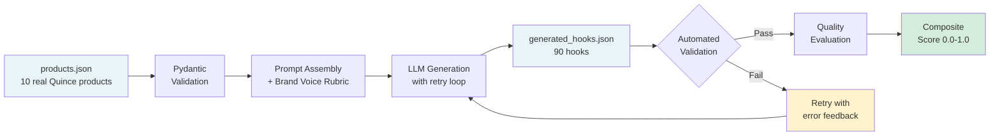
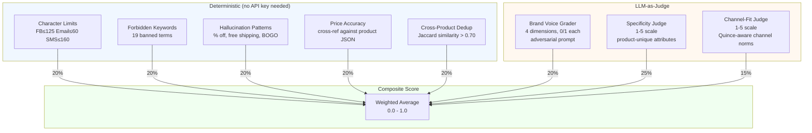
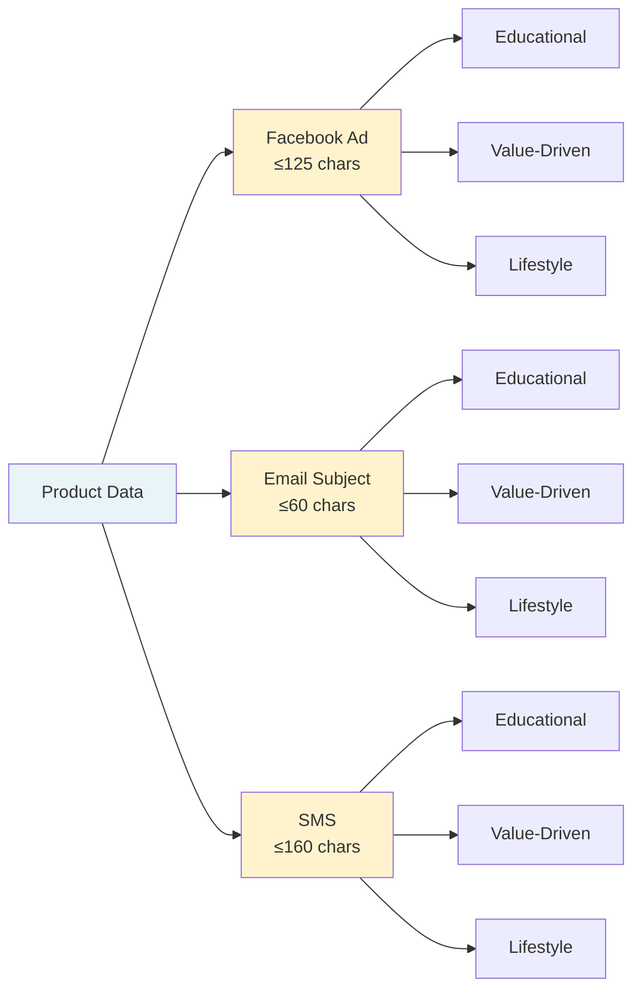
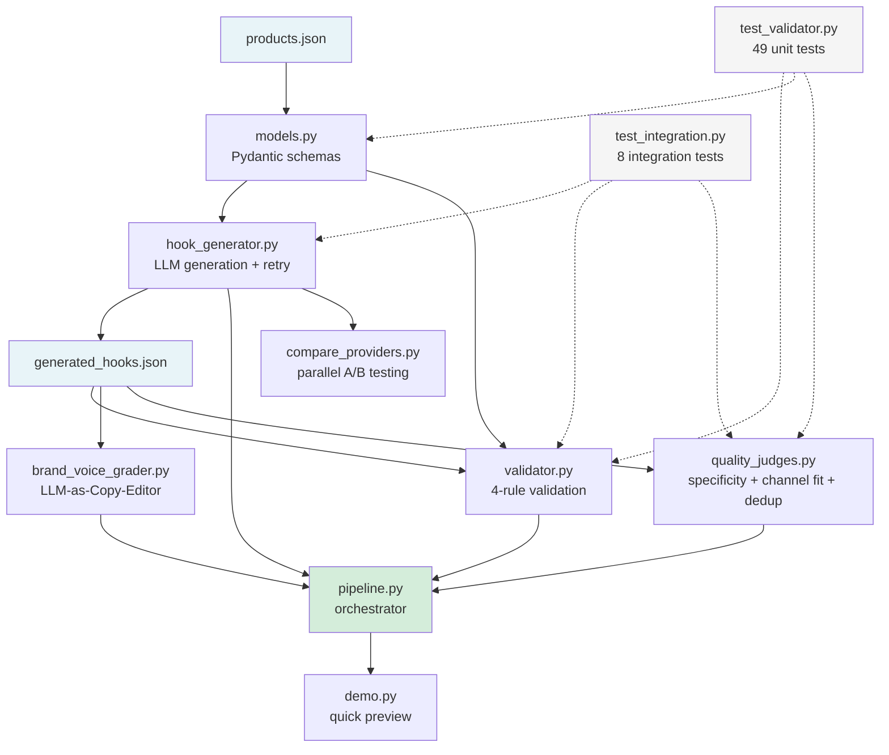

# Quince AI Creative Copilot

An AI-powered marketing automation system that generates product-specific ad copy ("hooks") for Facebook Ads, Email, and SMS — then validates, grades, and scores the output for brand compliance, product specificity, and channel fit.

## Quick Start

```bash
# 1. Install dependencies
pip install -r requirements.txt

# 2. Set an API key (pick one — Groq is free)
export GROQ_API_KEY=your-key
# or: export ANTHROPIC_API_KEY=your-key
# or: export OPENAI_API_KEY=your-key

# 3. Run the full pipeline
python3 pipeline.py
```

## Architecture

### Pipeline Flow



### Quality Evaluation Layers



### Hook Generation Per Product



> **10 products x 3 channels x 3 hook types = 90 hooks per pipeline run**

### File Dependency Map



## All Commands

### Run the Full Pipeline

```bash
# Full pipeline: generate → validate → grade → judge → composite score
python3 pipeline.py

# Skip LLM brand voice grading (faster)
python3 pipeline.py --skip-grading

# Skip LLM quality judges (still runs deterministic dedup)
python3 pipeline.py --skip-judges

# Fast mode: skip ALL LLM evaluation (generation + deterministic checks only)
python3 pipeline.py --fast
```

### Run Individual Components

```bash
# Generate hooks for all 10 products x 3 channels (90 hooks)
python3 hook_generator.py

# Validate generated hooks (deterministic — no API key needed)
python3 validator.py

# Grade hooks with Brand Voice Rubric (LLM-as-Copy-Editor)
python3 brand_voice_grader.py

# Run quality judges + composite score (specificity, channel fit, dedup)
python3 quality_judges.py

# Quality judges without LLM (deterministic dedup + composite only — no API key needed)
python3 quality_judges.py --skip-llm
```

### Run the Quick Demo

```bash
# Generates hooks for 3 products, validates, runs dedup, shows composite score (~15 seconds)
python3 demo.py
```

### Run Tests

```bash
# Unit tests — 49 tests (no API key needed)
python3 test_validator.py

# Integration tests — 8 tests with mocked LLM (no API key needed)
python3 test_integration.py

# All 57 tests
make test-all
```

### Compare Providers Side-by-Side

```bash
# Set multiple API keys, then run all in parallel
export GROQ_API_KEY=...
export ANTHROPIC_API_KEY=...
python3 compare_providers.py

# Quick comparison (2 products only)
python3 compare_providers.py --max-products 2 --channels facebook_ad,email_subject
```

### Commands That Don't Need an API Key

```bash
python3 validator.py                    # Validate existing generated_hooks.json
python3 quality_judges.py --skip-llm    # Run dedup + composite on existing hooks
python3 test_validator.py               # Unit tests (49)
python3 test_integration.py             # Integration tests with mocked LLM (8)
```

### Using Make

```bash
make install     # Install dependencies
make demo        # Quick demo (3 products)
make pipeline    # Full pipeline
make fast        # Fast mode (skip LLM eval)
make test        # Unit tests
make test-all    # Unit + integration tests
make compare     # Multi-provider parallel comparison
make clean       # Remove generated output files
```

## What Each File Does

| File | Purpose |
|------|---------|
| `hook_generator.py` | Generates 3 hook types (Educational, Value-Driven, Lifestyle) per product per channel |
| `validator.py` | 4-rule deterministic validator: char limits, forbidden keywords, hallucination patterns, price accuracy |
| `brand_voice_grader.py` | LLM-as-Copy-Editor: grades hooks against 4-dimension Brand Voice Rubric |
| `quality_judges.py` | Product specificity judge, channel-fit judge, cross-product dedup, composite scorer |
| `models.py` | Pydantic models for all data types |
| `pipeline.py` | 6-step pipeline orchestrator |
| `demo.py` | Quick demo with formatted output |
| `test_validator.py` | 49 unit tests |
| `test_integration.py` | 8 integration tests with mocked LLM (no API key needed) |
| `compare_providers.py` | Run all configured providers in parallel, compare output side-by-side |
| `products.json` | 10 real Quince products sourced from quince.com |
| `Makefile` | Convenience targets (`make demo`, `make test-all`, `make compare`, etc.) |
| `sample_output/` | Pre-generated hooks from Claude Sonnet for reviewer reference |

## Output Files

| File | Generated By |
|------|-------------|
| `generated_hooks.json` | `hook_generator.py` — 90 hooks (10 products x 3 channels x 3 types) |
| `validation_report.json` | `validator.py` — pass/fail per hook with violation details |
| `grading_report.json` | `brand_voice_grader.py` — brand voice scores per hook |
| `quality_report.json` | `quality_judges.py` — specificity, channel fit, dedup results |
| `composite_report.json` | `pipeline.py` — weighted composite quality score |

## Evaluation Layers

| Layer | Type | What It Measures |
|-------|------|-----------------|
| Deterministic Validator | Rules-based | Char limits, forbidden keywords, hallucination patterns, price accuracy |
| Hook Diversity | Rules-based | Min length, opening word variety, word overlap within a set |
| Brand Voice Grader | LLM | Quality & Premium, Value Proposition, Sustainability, Accuracy (0-1 each) |
| Product Specificity Judge | LLM | How uniquely a hook identifies its product (1-5) |
| Channel-Fit Judge | LLM | How natural the hook reads for its channel (1-5) |
| Cross-Product Dedup | Rules-based | Word overlap across products for the same channel/hook type |
| Composite Score | Weighted | Single 0.0-1.0 score combining all signals |

## Supported Providers

| Provider | Model | Cost | Env Variable |
|----------|-------|------|-------------|
| Groq | Llama 3.3 70B | Free | `GROQ_API_KEY` |
| Anthropic | Claude Sonnet | ~$0.003/hook | `ANTHROPIC_API_KEY` |
| OpenAI | GPT-4o-mini | ~$0.001/hook | `OPENAI_API_KEY` |
| Google | Gemini 2.0 Flash | Free tier | `GEMINI_API_KEY` |

Auto-detected based on which environment variable is set. Set multiple keys and run `make compare` to evaluate providers side-by-side.

## Sample Output (Claude Sonnet)

Pre-generated output is in `sample_output/` — no setup needed to review hook quality.

**Mongolian Cashmere Crewneck Sweater — Facebook Ad (≤125 chars):**

| Hook Type | Generated Copy | Chars |
|-----------|---------------|-------|
| Educational | *"15.8-16.2 micron Mongolian cashmere with 12-gauge construction—that's what makes luxury soft."* | 93 |
| Value-Driven | *"Premium Mongolian cashmere crewneck for $50. No middleman markup means no $148 retail price."* | 92 |
| Lifestyle | *"Cozy weight cashmere that regulates temperature during long client meetings and weekend coffee runs."* | 100 |

**End-to-end run stats:**
- **90 hooks** generated (10 products x 3 channels x 3 types) in ~100s
- **89/90 passed** validation (1 legitimate price-rounding catch: `$149` vs `$149.90`)
- **0.998 corpus uniqueness** — 1 near-duplicate pair correctly flagged
- **4/4 brand voice** on spot-checked hooks with full justification traces

## See Also

- `technical_note.md` — 1-page strategy document (pipeline, metrics, quality loop)
- `WALKTHROUGH.md` — Detailed design decisions and tradeoffs
- `IMPROVEMENT_PLAN.md` — Honest self-assessment and prioritized improvements
- `ai_process_log.md` — AI-assisted development process + human bug fixes
- `data_sourcing_log.md` — How real Quince product data was sourced
